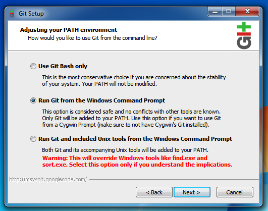
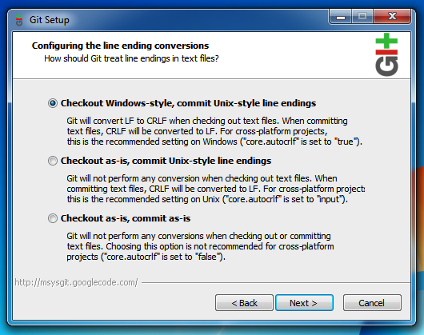

# Installation Instructions

## Installation on Windows
You can use either 

1. cygwin based
2. msysGit (better option)

You can install Git from here
[http://git-scm.com/download/win](http://git-scm.com/download/win)

## Choose these Options
Windows user can choose **Run Git from the Windows Command Prompt** 
This is an easy option To run Git from windows prompt.



## Line endings
Windows and Unix/Mac Treat line ending different.

Windows use CRLF for line ending.
Unix,Mac use LF  for line ending.

This option should be seriously considered if your collobration team use both mix of windows and Linux and Mac.




## Installation on Linux

Depending on the linux flavours you are using you can follow as below

If you want to install Git on Linux via a binary installer, you can generally do so through the basic package-management tool that comes with your distribution. If you’re on Fedora for example, you can use yum:

**For Fedora / CentOS :**

```
$ sudo yum install git
```

**For Debian / Ubuntu :**

```
$ sudo apt-get install git
```

For more options, there are instructions for installing on several different Unix flavors on the Git website, at [](http://git-scm.com/download/linux) .

## Installation on Mac

### Using GIT Installer
There are several ways to install Git on a Mac. The easiest is probably to install the Xcode Command Line Tools. On Mavericks (10.9) or above you can do this simply by trying to run git from the Terminal the very first time. If you don’t have it installed already, it will prompt you to install it.

If you want a more up to date version, you can also install it via a binary installer. An OSX Git installer is maintained and available for download at the Git website, at [http://git-scm.com/download/mac](http://git-scm.com/download/mac).

### Using Homebrew 

https://kj-prince.com/blog/install-git-mac-osx-homebrew/

## To Check Installation
To check if you have installed git on your computer, try this.
```
$ git --version
git version 1.7.12.4
```

## One Time Setup
One interesting aspect of Git is it makes who make what changes as a part and parcel of the workflow. 

You don't even need this to tell everytime.

Just Configure your username and email once.

```
git config user.name <name>
git config --global user.email <email>
```

Example:

```
git config --global user.name "Napoleon Arouldas"
git config --global user.email "crew@putforshare.com"
```

# To Setup an Editor for giving your commit message

git config --system core.editor <editor>

Often you would like to have commit message edited by git automatically invoking the editor.

To do that:

```
git config --system core.editor <editor>
```

## To Configure Sublime Text

git config --global core.editor "subl -n -w"

[To configure different editors with git](https://help.github.com/articles/associating-text-editors-with-git/)

## To Edit your config file

Lets open the config file in the editor that we just configured.

```
git config --global --edit
```

# To list all the config that we have done so far

```
git config --list
```

## Optional To Create SSH Keys
[https://help.github.com/articles/generating-ssh-keys](https://help.github.com/articles/generating-ssh-keys)

[https://help.github.com/ssh-issues/](https://help.github.com/ssh-issues/)

Git stores configuration options in three separate files, which lets you scope options to individual repositories, users, or the entire system:

    <repo>/.git/config – Repository-specific settings.
    ~/.gitconfig – User-specific settings. This is where options set with the --global flag are stored.
    $(prefix)/etc/gitconfig – System-wide settings. 

When options in these files conflict, 

local settings override user settings, which override system-wide. 

If you open any of these files, you’ll see something like the following:

```
[user] 
name = John Smith
email = john@example.com
[alias]
st = status
co = checkout
br = branch
up = rebase
ci = commit
[core]
editor = vim
```
