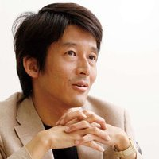

# Motivation

### Linus Torvalds

Linus Benedict Torvalds is a Finnish–American software engineer who is the creator, and historically, the principal developer of the Linux kernel, which became the kernel for many Linux distributions and operating systems such as Android and Chrome OS. He created the distributed version control system Git during 2005 to maintain the linux kernel versions 

### Junio Hamano

Junio C Hamano (濱野 純 Hamano Jun[1]?) is a Japanese software engineer and hacker best known for being the maintainer of Git since 26 July 2005.Linus Torvalds has said that one of his own biggest successes was recognizing how good a developer Hamano was on Git, and trusting him to maintain it. He lives in California and works for Google.